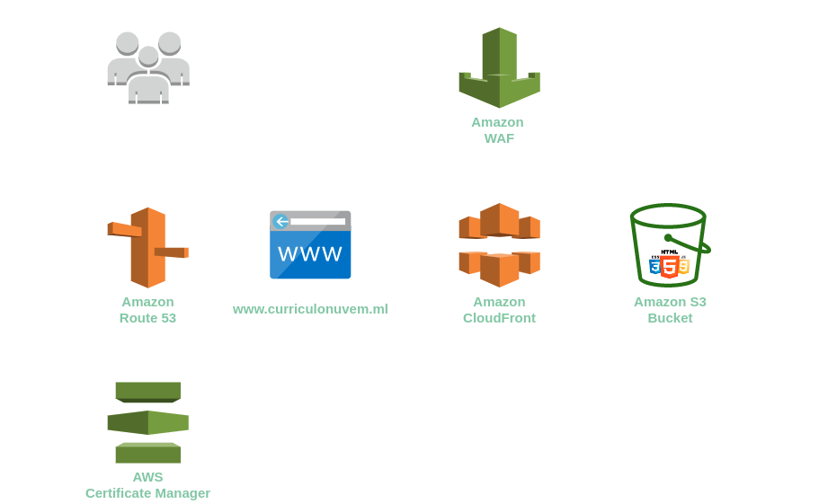

# Projeto Website para Divulgação de Currículo - Escola da Numvem
  Website simples feito com html, css e Javascript feito para colocar em funcionamento em uma arquitetura na nuvem Aws. Utilizando os seguintes serviços: Route 53, Certificate Manager, WAF, CloudFront e S3 standard.

## Integrantes:
  - Gabriel Silva
  - Dheniarley Cruz
  - Jéssica Prandini
  - Patrícia Oliveira
 
 ## Objetivos:
  Desenvolvimento de um website (html, css, imagens) contendo os currículos do grupo e a implantação de um ou mais serviços na nuvem AWS, com rede de entrega de conteúdo, com baixa latência, com segurança, e armazenamento durável, para atender a demanda de 11 milhões de requisições¹ por mês.

## Serviços da Aws usados:
  - <b>Amazon Route 53:</b>  É um Domain Name System (DNS) responsável por direcionar os usuários às aplicações web.
      - Zona hospedada, objetivo é transferir o serviço DNS de um domínio existente para o Route 53
      - Criação do registro CNAME para validação do certificado SSL
  - <b>AWS Certificate Manager(ACM)</b>:  É um serviço que permite provisionar, gerenciar e implantar facilmente certificados SSL/TLS para uso com os serviços da AWS e os recursos internos conectados.
    - Criar e gerenciar o certificado SSL público da amazon.
  - <b>Amazon CloudFront:</b>  é um serviço de rede de entrega de conteúdo (CDN) criado para alta performance, segurança e conveniência do desenvolvedor.
    - Criação da distribuição com objetivo  de entrega de conteúdo com segurança, baixa latência e altas velocidades de transferência. 
    - Ativação do aws WAF dentro do CloudFront
  - <b>AWS WAF:</b>  é um firewall de aplicações Web que ajuda a proteger suas aplicações Web ou APIs contra bots e exploits comuns na Web que podem afetar a disponibilidade, comprometer a segurança ou consumir recursos em excesso.
    - Proteção da aplicação especificando qual tráfego será permitido.
    - Bloquear requisições maliciosas como SQL Injection.
    - Bloquear países.
  - <b>AWS S3:</b> é um serviço de armazenamento de objetos que armazena dados como objetos em buckets.
    - Amazon S3 Standard: Armazenamento dos arquivos do website,  configuração da política do bucket e ativar hospedagem de site estático.
  - <b>AWS Pricing Calculator:</b>  É uma ferramenta de planejamento baseada na web que você pode usar para criar estimativas para o AWS casos de uso. Você pode usá-lo para modelar suas soluções antes de criá-las, explore o AWS pontos de preço de serviço e revise os cálculos por trás de suas estimativas.

## Arquitetura
  
  
## Proposta
  
  
